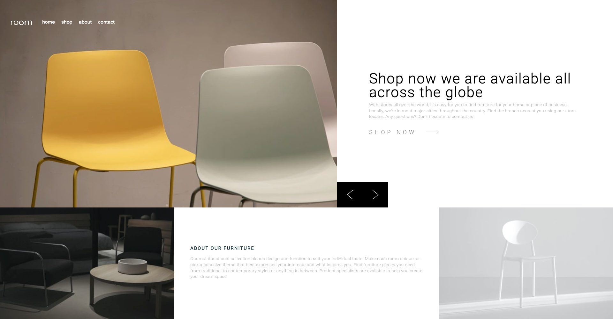

# Frontend Mentor - Room homepage solution

This is a solution to the [Room homepage challenge on Frontend Mentor](https://www.frontendmentor.io/challenges/room-homepage-BtdBY_ENq). Frontend Mentor challenges help you improve your coding skills by building realistic projects.

## Overview

### The challenge

Users should be able to:

- View the optimal layout for the site depending on their device's screen size
- See hover states for all interactive elements on the page
- Navigate the slider using either their mouse/trackpad or keyboard

### Screenshot



### Links

- Solution URL: [](https://github.com/WeKiBan/Room)
- Live Site URL: [](https://wekiban.github.io/Room/)

### Built with

- HTML/CSS
- Flexbox
- [React](https://reactjs.org/) - JS library
- [Styled Components](https://styled-components.com/) - For styles

### What I learned

This is the first project where I have used the Styled-Components library and so I had to learn everything from scratch which made the process a little slower. I really like the way all of the styling is written in the css syntax with the advantage of being able to pass variables as props to the components. I used this feature to open and close the mobile navbar by keeping track of the opening and closing using a useState hook and then passing that variable into the Styled-Component as shown below:

```javascript
<MobileNavStyled navIsOpen={navIsOpen}>
```

I could then access this variable within the Styled-Component and then add styles accordingly as shown below:

```css
height: ${({ navIsOpen }) => (navIsOpen ? '100px' : '0')};
```

As there were two lots of pictures to be displayed on the website (one intended for mobile screens and the other for desktops) I decided to make useState hook to keep track of the window size and then the useEffect hook to add an event listener to the window resize event as shown below:

```javascript
  const [windowSize, setWindowSize] = useState(window.innerWidth);
  useEffect(() => {
    const handleResize = () => {
      const newSize = window.innerWidth;
      setWindowSize(newSize);
  };
```

This way I was able to use inline-styling to select either the desktop or mobile picture as shown below:

```javascript
<div
        onClick={() => slideUp()}
        className="imgContainer"
        style={{ backgroundImage: `url(${images[windowSize > 400 ? 0 : 1]})` }}
      >
```

During this project I think I've grasped a good knowledge of the Styled-Components Library. I have really enjoyed using it and of all of the tools I've used up until this point it is one of my favorites and I'm definitely going to be using it in future.

### Continued development

As this project only Required me to build the landing page I could also come back and flesh out the project by building the rest of the site utilizing something like react-router

### Useful resources

- [Traversy Media Styled Components Crash Course & Project](https://www.youtube.com/watch?v=02zO0hZmwnw&t=276s) - This is the course I used to learn the basics of styled components. I found it very easy to follow and would definitely recommend it for anyone else looking to learn this technology.

## Get started

### Clone this repository

From your command line, first clone this repo: https://github.com/WeKiBan/new-portfolio

`$ git clone https://github.com/WeKiBan/new-portfolio`

### Go into the repository

`$ cd new-portfolio`

### Remove current origin repository

`$ git remote remove origin`

### Install dependencies

`$ npm install`

### Start development server

`$ npm start`

You should now have a development server running in your default browser.
